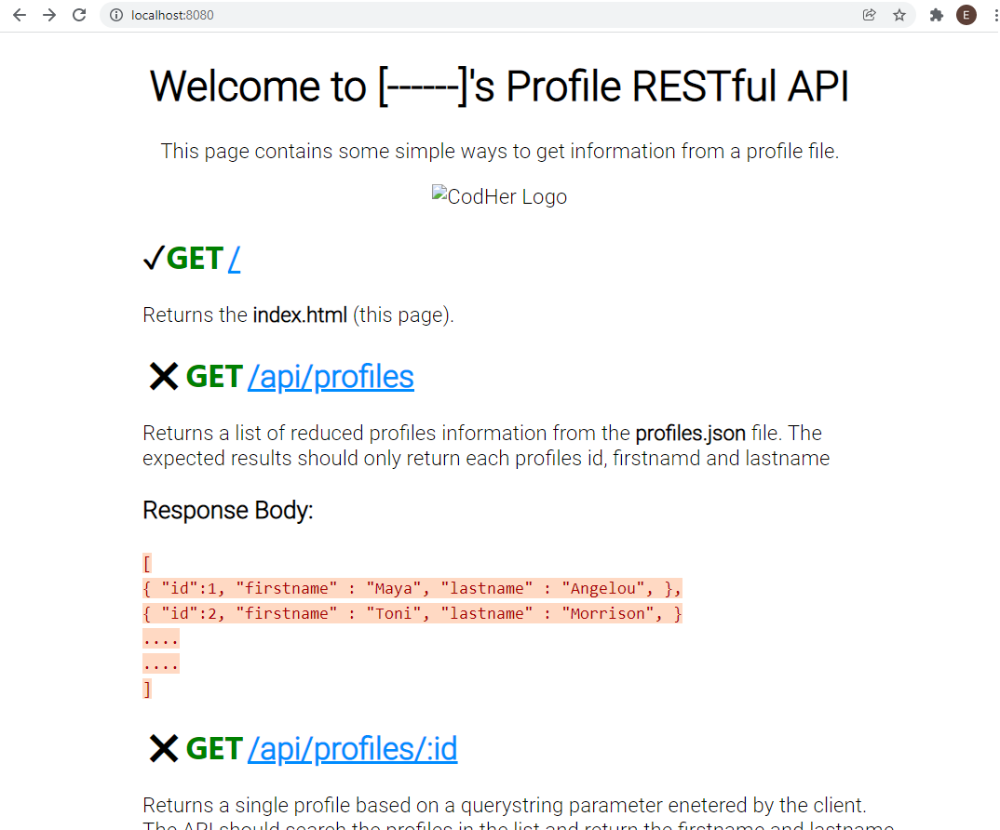

# Build an API

This README outlines the steps to build a comprehensive API for creating, reading, updating, and deleting profiles from a `profiles.json` file.

## Table of Contents

1. [Task Setup](#task-setup)
1. [Understanding the Task Structure](#understanding-the-task-structure)
1. [Personalising and Implementing API Functionality](#personalising-and-implementing-api-functionality)


## Task Setup

- Install necessary Node libraries: Run `npm install` in the terminal.
- Start the project with `npm start`.

## Understanding the Task Structure

- The `profiles.json` file in the `models` folder serves as a mock data store.
- In real-world applications, such data is typically stored in a database.
- The homepage at [http://localhost:8080/](http://localhost:8080/) loads `index.html`, which outlines all expected API endpoints.
- Ensure the `src` link for the CBF Academy logo in `index.html` points to the correct virtual path.

## Personalising and Implementing API Functionality

- Personalise the `index.html` title to include your name, e.g., "Welcome to [Your Name]'s RESTful API."
- Implement the API endpoints as described in `index.html`:

  ```sh
  GET /api/profiles
  GET /api/profiles/:id
  POST /api/profiles
  PUT /api/profiles/:id
  PATCH /api/profiles/:id
  DELETE /api/profiles/:id
  ```

  

The completion of these steps will result in a fully functional API capable of handling various operations on the profiles data.
