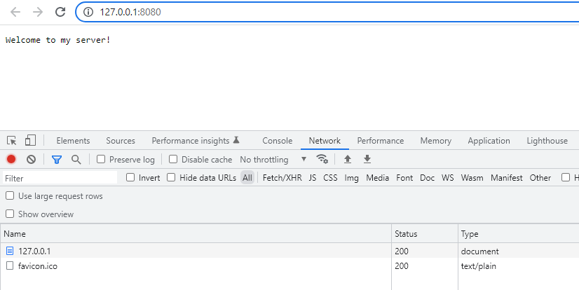
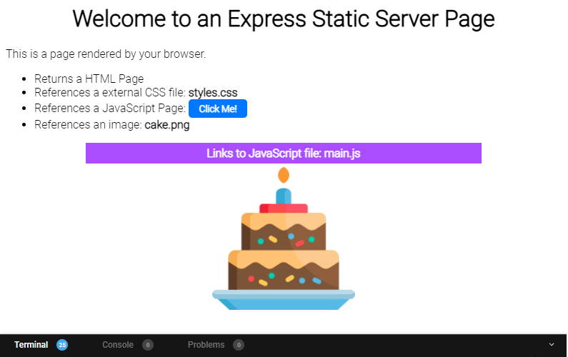

# Static File Server

## Table of Contents

- [Creating a Simple Server](#creating-a-simple-server)
- [Static Express File Server](#static-express-file-server)

## Creating a Simple Server

**Objective**: Establish a basic Node.js server that responds to browser requests.

### Steps

1. **Server Code**: Below is the example server code that returns 'Hello World!' at `http://localhost:8080`.

   ```js
   const http = require("http");

   http
     .createServer(function (req, res) {
       res.statusCode = 200;
       res.setHeader("Content-Type", "text/plain");
       res.end("Hello, World!");
     })
     .listen(8080);
   ```

2. **Run Server**: Execute node index.js in the terminal to start the server.
3. **View in Browser**: Navigate to [http://localhost:8080](ttp://localhost:8080) to see the 'Hello World!' message.
4. **Modify Response**: Alter the response in index.js to "Welcome to my server!" and restart to see the updated message.
5. **Browser Tools**: Utilise Developer's Tools (F12 on Windows) to inspect the Network tab for detailed response information.
6. **Error Simulation**: Change index.js to return a 500 status code with an "Oops! Something went wrong" message, then restart and observe the changes.

### Visual Aid



## Static Express File Server

This task involves creating a static file server using Express to serve a single page as the homepage.

### Overview

- **Project Introduction**: Set up a static file server utilising Express.
- **Server Functionality**: The server will serve an `index.html` page as the homepage, accessible at [http://localhost:8080](ttp://localhost:8080).

### Steps

1. **Setup**: Start by opening the static-file-server folder containing the necessary files.
2. **Install Dependencies**: Ensure all Node library dependencies are installed:

```sh
npm install
```

3. **Configure Server**: Update index.js to enable serving of static files (images, CSS, JS) from a content virtual path and the public directory.
4. **Running the Server**: Launch the server using:

```sh
npm start
```

5. **Testing Static Files**: Check server functionality by accessing http://localhost:8080/content/images/cake.png to display a cake image.
6. **Final Server Checks**: Ensure the server properly produces a page with external CSS styles and a "Click Me!" button. The final page should look like the provided screenshot:



7. **No HTML Modifications**: No alterations are needed in index.html. All functionality should be achieved through changes in index.js.
